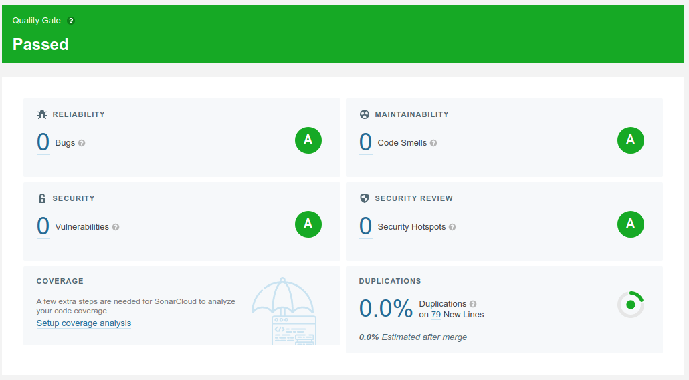

# Plano de Qualidade

## Histórico de Revisão
| Data | Versão | Descrição | Autor(es) |
|:----:|:------:|:---------:|:---------:|
| 06/11/2021 | 1.0 | Criação do documento | Grupo EPS |
| 07/11/2021 | 1.1 | Adição do Processo de Qualidade | Sofia Patrocínio |

## Introdução

De acordo com a ISO 25010, a qualidade do produto de software pode ser interpretada como o grau em que o referido produto atende aos requisitos de seus usuários, agregando valor. São exatamente esses requisitos (funcionalidade, desempenho, segurança, manutenibilidade, etc.) que estão representados no modelo de qualidade, que categoriza a qualidade do produto em características e subcaracterísticas. Para alcançar tais requisitos é de suma importância o desenvolvimento e apuração das métricas de forma contínua. O objetivo do planejamento de qualidade é descrever como essa apuração foi feita durante o projeto.

## Processo de Qualidade
Para a coleta de métricas em nosso projeto, criamos uma integração utilizando a ferramenta SonarQube para cada serviço desenvolvido. Isso foi alcançado utilizando a interface SonarCloud que possibilita uma visibilidade mais amigável para a análise de todas as métricas coletadas em cada serviço.

Através das métricas, utilizando-as de forma análitica foi possível implementar melhorias na qualidade e saúde do código.

Além de analisar métricas em relação a qualidade do código, foi de suma importância avaliar também a qualidade do produto em relação a usabilidade. Para isso, utilizamos de formulários disponibilizados aos usuários e diferentes versões com ajustes.

### [APK Versão 1.0 (22/10)](https://expo.dev/artifacts/2374dd5d-c109-4093-b6b4-4d11b888f023)
Funcionalidades presentes:
- Visualizar línguas por ordem alfabética
- Visualizar línguas por família linguística
- Ver dicionário de palavras de uma lingua específica
- Ver tradução de uma palavra para o português formal
- Visualizar imagens relativas às palavras uma língua

### [APK Versão 1.1 (29/10)](https://drive.google.com/file/d/1PqtTPDOrGNvWp1JlP5IkeBeiv3iSKtyv/view?usp=sharing)
Funcionalidades presentes:
- Visualizar línguas através do mapa
- Ver detalhes de uma língua ao clicar em um ponto no mapa
- Visualizar línguas por ordem alfabética
- Visualizar línguas por família linguística
- Ver dicionário de palavras de uma lingua específica
- Ver tradução de uma palavra para o português formal
- Visualizar imagens relativas às palavras uma língua

Melhorias em relação a versão 1.0:
- Apresentação do mapa, que não estava funcionando na versão anterior.
- Correção de família linguística, pois em alguns locais estava mostrando como tronco linguístico.

### [APK Versão 1.2 (03/11)](https://expo.io/artifacts/318c7636-e116-47ca-9ad7-2d4c803a7000)
Funcionalidades presentes:
- Visualizar línguas através do mapa
- Ver detalhes de uma língua ao clicar em um ponto no mapa
- Visualizar línguas por ordem alfabética
- Visualizar línguas por família linguística
- Ver dicionário de palavras de uma lingua específica
- Ver tradução de uma palavra para o português formal
- Visualizar imagens relativas às palavras uma língua

Melhorias em relação a versão 1.1:
- Na página de dicionário, ao invés de separar palavras por letras, foram mostradas de forma direta
- Tratamento de erros em línguas que não possuem determinada informação
- Adição de loading enquanto dados são carregados

### APK Versão 1.3 (08/11)
Funcionalidades presentes:
- Visualizar línguas através do mapa
- Ver detalhes de uma língua ao clicar em um ponto no mapa
- Visualizar línguas por ordem alfabética
- Visualizar línguas por família linguística
- Ver dicionário de palavras de uma lingua específica
- Ver tradução de uma palavra para o português formal
- Visualizar imagens relativas às palavras uma língua

Melhorias em relação a versão 1.2:
- Mostrar línguas em ordem alfabética por padrão
- Ajuste de tamanho dos pontos do mapa
- Ajuste no botão de visualizar imagem na tela de palavra específica

Além disso, através do Jupyter Notebook, foi realizada a interpretação das métricas fornecidas pela ferramenta SonarQube levando em conta fatores de qualidade como Manutenibilidade e Confiabilidade e suas subcaracterísticas nos diferentes repositórios utilizados no projeto.

[Acesse aqui](https://github.com/fga-eps-mds/2021.1-Multilind-Docs/blob/main/analytics/analytics.ipynb)

## Referências
[ISO/IEC 25010](https://iso25000.com/index.php/en/iso-25000-standards/iso-25010)